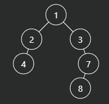

# 构建二叉树

## 1. 问题

- 在刷LeetCode中有关二叉树的题目时，输入往往是一个列表，列表的值就是二叉树每一个节点的val，但如果我们想在本地IDE中进行调试，就需要将这个列表转换为二叉树，那么应该如何转换呢？

## 2. 分析输入

- 对于LeetCode上的题目（其他OJ平台笔者就不清楚了），给出的输入列表都是二叉树的“层序遍历”值，注意这里的层序遍历打了引号，因为和我们通常的层序遍历列表不同，这里给到的输入列表是包含了空节点的，举例说明：

  - 对于这样一个二叉树：

    

  - 通常的层序遍历结果是：

    ```python
    lLevelOrder: List = [10, 2, 13, 1, 18, 15]
    ```

  - 但是如果作为表示一个二叉树的输入，LeetCode上给出的格式是：

    ```python
    lLevelOrder1: List = [10, 2, 13, 1, None, None, 18, None, None, 15]
    lLevelOrder2: List = [10, 2, 13, 1, None, None, 18, None, None, 15, None]
    ```

    因为这两个输入都能够被检测通过，而笔者也不太清楚需不需要最后的那个None，所以这里都给出了，但是不会影响后续给出的解答的核心逻辑，所以也不用太纠结。

  - 显然，普通的层序遍历的列表是可以构建出多种二叉树结构的，所以我们需要将空节点也标识出来。

- 现在我们来分析一下这个输入：

  ```python
  lLevelOrder1: List = [10, 2, 13, 1, None, None, 18, None, None, 15]
  
  # 按层来分割
  lLevel1: List = [10]
  lLevel2: List = [2, 13]
  lLevel3: List = [1, None, None, 18]
  lLevel4: List = [None, None, 15]
  ```

  可以看到，①对第一层的节点10，第二层的2和13分别是10的左右孩子节点；②对第二层的2，第三层的1和None分别是左右孩子节点，对第二层的13，第三层的None和18分别是左右孩子节点；③对第三层，我们**仅考虑非空节点**，也就是只剩下**1和18两个节点**，那么同理第四层的**三个或四个节点（这里是三个）**分别是第三层中**两个非空节点**的左右孩子节点（这里就是前面提到的最后一个None的问题，因为到了最后一层，最后一个None节点不影响二叉树的结构，所以是否存在只影响代码细节，不会影响主要逻辑）。

## 3. 代码示例

- 根据前面的分析过程，给出一个实现方式：（相关细节在代码注释中，注意这里没有对输出是否合法进行检查）

  ```python
  def list_to_binary_tree(lValues: List) -> TreeNode:
      """
      列表生成二叉树（没有对输入列表是否合法做检查）
      :param lValues: 二叉树的层序遍历值（注意空节点会用None记录）
      :return: TreeNode 根节点
      """
      if not lValues:
          return
      oRoot: TreeNode = TreeNode(val=lValues[0])
      iCurIdx: int = 1  # 记录当前走到了哪个节点
      qDeque: deque = deque()
      qDeque.append(oRoot)  # 本质是层序遍历，所以使用一个队列来保存节点
      while qDeque:
          iCurLength: int = len(qDeque)
          for _ in range(iCurLength):
              oCur: TreeNode = qDeque.popleft()
              if iCurIdx >= len(lValues):  # 这里就是前面提到的处理最后一个不影响二叉树结构的空节点的方式
                  return oRoot
              if lValues[iCurIdx] != None:
                  oCur.left = TreeNode(lValues[iCurIdx])
                  qDeque.append(oCur.left)
              iCurIdx += 1
              if iCurIdx >= len(lValues):  # 这里就是前面提到的处理最后一个不影响二叉树结构的空节点的方式
                  return oRoot
              if lValues[iCurIdx] != None:
                  oCur.right = TreeNode(lValues[iCurIdx])
                  qDeque.append(oCur.right)
              iCurIdx += 1
      return oRoot
  ```

## 4. 总结思考

- 总体上是一个模拟的题目，或者说是层序遍历的一个逆过程，但又不是通常情况下的层序遍历列表，个人还没有总结出很直观的收获，不过用于本地调试是没有问题的。